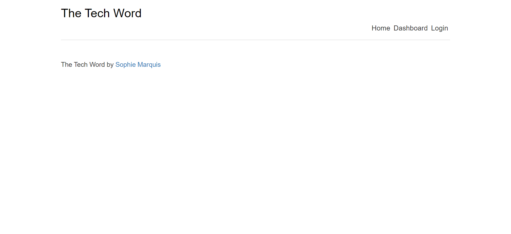

# C14-MVCBlog
Challenge 14 - Boot Camp

[](https://opensource.org/licenses/MIT)


## Table of Contents

  1. [Description of Assignment](#description-of-assignment)
  2. [About](#about)
      1. [User Story](#user-story)
      2. [Acceptance criteria](#acceptance-criteria)
  3. [Screenshots](#screenshots)    
  4. [License](#license)
  5. [Contact](#contact)
  6. [Final Work Review](#final-work-review)


  ## Description of Assignment

Writing about tech can be just as important as making it. Developers spend plenty of time creating new applications and debugging existing codebases, but most developers also spend at least some of their time reading and writing about technical concepts, recent advancements, and new technologies. A simple Google search for any concept covered in this course returns thousands of think pieces and tutorials from developers of all skill levels!

Your challenge this week is to build a CMS-style blog site similar to a Wordpress site, where developers can publish their blog posts and comment on other developers’ posts as well. You’ll build this site completely from scratch and deploy it to Heroku. Your app will follow the MVC paradigm in its architectural structure, using Handlebars.js as the templating language, Sequelize as the ORM, and the express-session npm package for authentication.

  ## About 

---
### User Story

```
AS A developer who writes about tech
I WANT a CMS-style blog site
SO THAT I can publish articles, blog posts, and my thoughts and opinions
```
### Acceptance Criteria

```
GIVEN a CMS-style blog site
WHEN I visit the site for the first time
THEN I am presented with the homepage, which includes existing blog posts if any have been posted; navigation links for the homepage and the dashboard; and the option to log in
WHEN I click on the homepage option
THEN I am taken to the homepage
WHEN I click on any other links in the navigation
THEN I am prompted to either sign up or sign in
WHEN I choose to sign up
THEN I am prompted to create a username and password
WHEN I click on the sign-up button
THEN my user credentials are saved and I am logged into the site
WHEN I revisit the site at a later time and choose to sign in
THEN I am prompted to enter my username and password
WHEN I am signed in to the site
THEN I see navigation links for the homepage, the dashboard, and the option to log out
WHEN I click on the homepage option in the navigation
THEN I am taken to the homepage and presented with existing blog posts that include the post title and the date created
WHEN I click on an existing blog post
THEN I am presented with the post title, contents, post creator’s username, and date created for that post and have the option to leave a comment
WHEN I enter a comment and click on the submit button while signed in
THEN the comment is saved and the post is updated to display the comment, the comment creator’s username, and the date created
WHEN I click on the dashboard option in the navigation
THEN I am taken to the dashboard and presented with any blog posts I have already created and the option to add a new blog post
WHEN I click on the button to add a new blog post
THEN I am prompted to enter both a title and contents for my blog post
WHEN I click on the button to create a new blog post
THEN the title and contents of my post are saved and I am taken back to an updated dashboard with my new blog post
WHEN I click on one of my existing posts in the dashboard
THEN I am able to delete or update my post and taken back to an updated dashboard
WHEN I click on the logout option in the navigation
THEN I am signed out of the site
WHEN I am idle on the site for more than a set time
THEN I am able to view posts and comments but I am prompted to log in again before I can add, update, or delete posts
```

## Screenshots




## License

License used for this project - MIT
  * For more information on license types, please reference this website
  for additional licensing information: [https: //choosealicense.com/](https://choosealicense.com/).


  ## Contact

  * GitHub Username: [SMarquis85](https://github.com/SMarquis85)
  * Email: sophienathalie_85@outlook.com


  ## Final Work Review

**"Always leave the code a little cleaner than when you found it."**  This action was applied to ALL JAVASCRIPT files. To create this assignment, I used Lawrence Wilson's Audiobook, Cathy Tanimura's book on SQL. References we're found on Google, multiple websites including W3Schools, DEV, GitHub, Insomnia and Tutorialspoint. YouTube was helpful as well as all ZOOM recordings (of previous classes). Looks much cleaner, organised and easier to find what you are looking for. I also received the help of my tutor, Erik Hoversten. He helped me fix the errors I have encountered while deploying to Heroku. 

> **(CARL-VIRT-FSF-PT-04-2023, Challenge 14 / README.md 2023)**

> **(JavaScript Full Stack Developers, Lawrence Wilson; Audiobook (2023) 6hrs and 29mins. )**

> **(SQL for Data Analysis: Advanced Techniques for Transforming Data into Insights, Cathy Tanimura; 1st edition (Oct. 19th 2021) 357 pages.)**


## Heroku Deployed Link

https://frozen-tundra-42313-1be74e9a646c.herokuapp.com/ 

## Github Repository Link:

https://github.com/SMarquis85/C14-MVCBlog 
